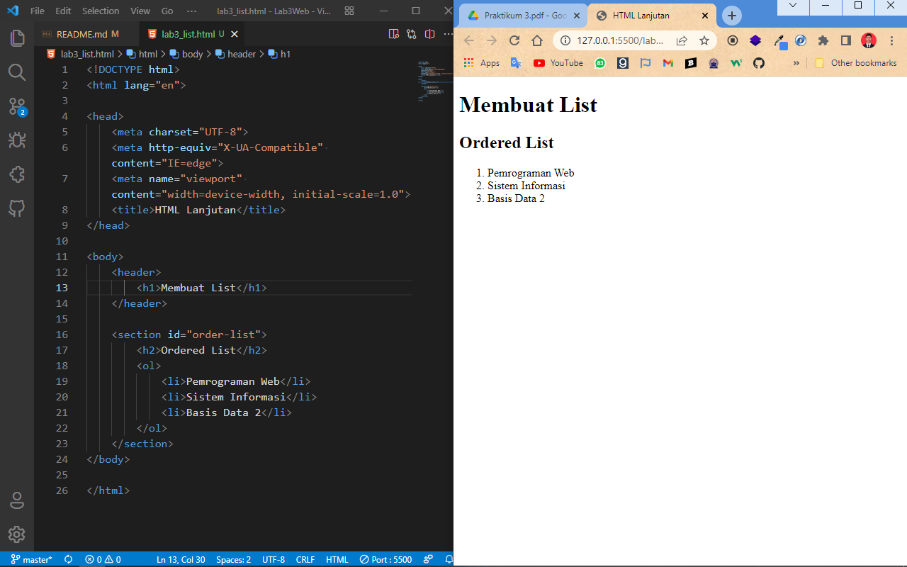
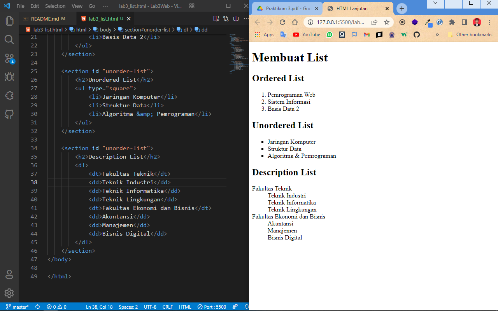

# Tugas Lab 3 Web
## Profil
| #               | Biodata             |
| --------------- | ------------------- |
| **Nama**        | Reza Riyaldi Irawan |
| **NIM**         | 312010284           |
| **Kelas**       | TI.20.A.2           |
| **Mata Kuliah** | Pemrograman Web     |

## Langkah 1 `Persiapkan File HTML`
1. Buat File HTML bernama `lab3_list.html`.
2. Lalu tambahkan kode berikut.

```html
<!DOCTYPE html>
<html lang="en">

<head>
    <meta charset="UTF-8">
    <meta http-equiv="X-UA-Compatible" content="IE=edge">
    <meta name="viewport" content="width=device-width, initial-scale=1.0">
    <title>HTML Lanjutan</title>
</head>

<body>
    <header>
        <h1>Membuat List</h1>
    </header>
</body>

</html>
```

## Langkah 2 `Membuat Ordered List`
1. Tambahkan kode `ordered list` berikut.
```html
<section id="order-list">
  <h2>Ordered List</h2>
  <ol>
    <li>Pemrograman Web</li>
    <li>Sistem Informasi</li>
    <li>Basis Data 2</li>
  </ol>
</section>
```

2. Maka hasilnya akan seperti berikut.


## Langkah 3 `Membuat Unordered List`
1. Tambahkan kode `unordered list` berikut.
```html
<section id="unorder-list">
  <h2>Unordered List</h2>
  <ul type="square">
    <li>Jaringan Komputer</li>
    <li>Struktur Data</li>
    <li>Algoritma &amp; Pemrograman</li>
  </ul>
</section>
```

2. Maka hasilnya akan seperti berikut.


## Langkah 4 `Membuat Description List`
1. Tambahkan kode `description list` berikut.
```html
<section id="unorder-list">
  <h2>Description List</h2>
  <dl>
    <dt>Fakultas Teknik</dt>
    <dd>Teknik Industri</dd>
    <dd>Teknik Informatika</dd>
    <dd>Teknik Lingkungan</dd>
    <dt>Fakultas Ekonomi dan Bisnis</dt>
    <dd>Akuntansi</dd>
    <dd>Manajemen</dd>
    <dd>Bisnis Digital</dd>
  </dl>
</section>
```

2. Maka hasilnya akan seperti berikut.


## Langkah 5 `Membuat Table`
1. Membuat File baru bernama `lab3_table.html`.
2. Buat struktur dasar HTML.
3. Tambahkan kode `table` berikut.
```html
<table border="1" cellpadding="4" cellspacing="0">
    <thead>
        <tr>
            <th>No.</th>
            <th>Fakultas</th>
            <th>Program Studi</th>
        </tr>
    </thead>
    <tbody>
        <tr>
            <td>1.</td>
            <td>Teknik</td>
            <td>Teknik Informatika</td>
        </tr>
        <tr>
            <td>2.</td>
            <td>Teknik</td>
            <td>Teknik Industri</td>
        </tr>
        <tr>
            <td>3.</td>
            <td>Teknik</td>
            <td>Teknik Lingkungan</td>
        </tr>
    </tbody>
</table>
```

3. Maka hasilnya akan seperti berikut.


## Langkah 6 `Menggabungkan Sel Data`
1. Untuk menggabungkan sel data, dapat menggunakan atribut `rowspan` (secara vertikal) dan `colspan` (secara horizontal).
2. Saya akan merubah pada sel _teknik_.
```html 
<tbody>
  <tr>
    <td>1.</td>
    <td rowspan="3">Teknik</td>
    <td>Teknik Informatika</td>
  </tr>
  <tr>
    <td>2.</td>
    <td>Teknik Industri</td>
  </tr>
  <tr>
    <td>3.</td>
    <td>Teknik Lingkungan</td>
  </tr>
</tbody>
```

3. Maka hasilnya akan seperti berikut.


## Langkah 7 `Membuat Form`
1. Buat file baru bernama `lab3_form.html.
2. Buat struktur dasar HTML.
3. Tambahkan kode `form` sederhana berikut.
```html
<form action="proses.php" method="post">
    <fieldset>
        <legend>Data Pelanggan</legend>
        <p>
            <label for="nama">Nama</label>
            <input type="text" id="nama" name="nama">
        </p>
        <p>
            <label for="alamat">Alamat</label>
            <textarea id="alamat" name="alamat" cols="20" rows="3"></textarea>
        </p>
        <p>
            <label>Jenis Kelamin</label>
            <input id="jk_l" type="radio" name="kelamin" value="L" />
            <label for="jk_l">Laki-laki</label>

            <input id="jk_p" type="radio" name="kelamin" value="P" />
            <label for="jk_p">Perempuan</label>
        </p>
        <p><input type="submit" value="Login"></p>
    </fieldset>
</form>
```

3. Maka hasilnya akan seperti berikut.


## Langkah 8 `Menambahkan Style pada Form`
1. Tambahkan style css berikut pada head file `lab3_form.html`
```css
<style>
    form p>label {
        display: inline-block;
        width: 100px;
    }

    form input[type="text"], form textarea {
        border: 1px solid #197a43;
    }

    form input[type="submit"] {
        border: 1px solid #197a43;
        background-color: #197a43;
        color: #ffffff;
        font-weight: bold;
        padding: 5px 15px;
    }
</style>
```

2. Maka hasilnya akan seperti berikut.


# Pertanyaan
### 1. Buatlah form yang menampilkan _dropdown_ menu dan _listbox_ dengan multiple selection.

### Jawab
A. Membuat _dropdown_
* Tambahkan kode dropdown berikut untuk memilih golongan darah.
```html
<p>
    <label>Golongan Darah</label>

    <select name="gol_dar" id="gol_dar">
        <option>- Pilih golongan darah -</option>
        <option value="A">A</option>
        <option value="B">B</option>
        <option value="AB">AB</option>
        <option value="O">O</option>
    </select>
</p>
```

* Maka hasilnya akan seperti berikut.


B. Membuat _listbox_
* Tambahkan kode listbox berikut untuk memilih hobi.
```html
<p>
    <label>Hobi</label>

    <select name="gol_dar" id="gol_dar" multiple>
        <option>- Pilih Hobi -</option>
        <option value="Sepak Bola">Sepak Bola</option>
        <option value="Berenang">Berenang</option>
        <option value="Badminton">Badminton</option>
        <option value="Bermain Alat Musik">Bermain Alat Musik</option>
        <option value="Memasak">Memasak</option>
        <option value="Membaca">Membaca</option>
    </select>
</p>
```
* Maka hasilnya akan seperti berikut.


> Perbedaannya terletak pada atribut `multiple` pada tag `<select>`. Apabila atribut ini ditambahkan dan dibuka dibrowser PC maka bisa memilih lebih dari satu, lalu terdapat atribut size yang dimana defaultnya itu 4, dan saya rubah ke 5 agar lebih besar barisannya.